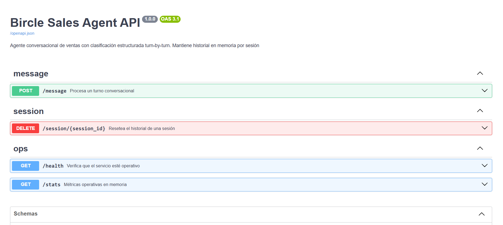
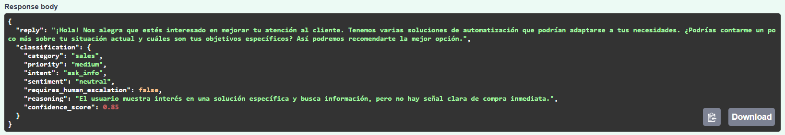
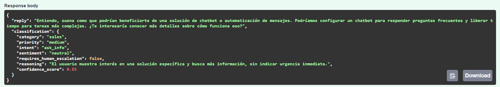
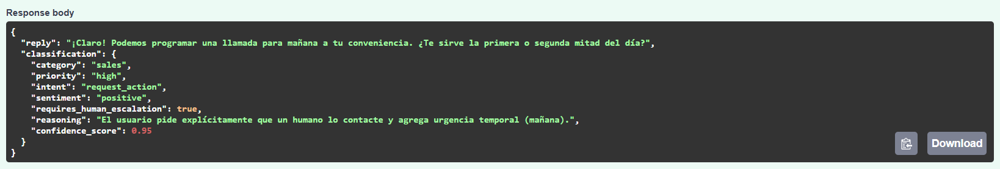
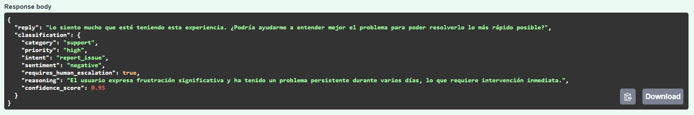
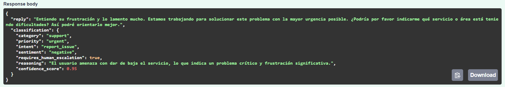
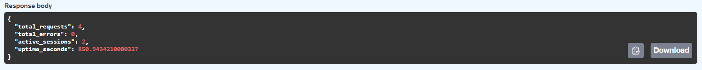
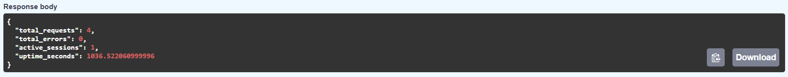

# Bircle Sales Agent API

API REST de un agente conversacional de ventas implementado con **FastAPI** y **LangChain**. Recibe mensajes de usuario, mantiene el historial conversacional en memoria por sesión y devuelve una respuesta textual junto con una clasificación estructurada del turno actual

---

## Características

- **Endpoint conversacional** con clasificación estructurada turn-by-turn
- **Memoria por sesión** en memoria del proceso (sin persistencia)
- **Multi-proveedor LLM**: soporta Ollama (local), OpenAI y Anthropic
- **Salida estructurada validada** con Pydantic v2 y dominios cerrados (`Literal`)
- **Fallback robusto** ante salidas malformadas del modelo
- **Endpoints operativos**: `/health` y `/stats`
- **Reset de sesión** vía `DELETE /session/{session_id}`
- **Configuración por variables de entorno** (12-Factor App)

---

## Stack

- Python 3.11+
- FastAPI + Uvicorn
- LangChain + LangChain providers (OpenAI, Anthropic, Ollama)
- Pydantic v2 + pydantic-settings

---

## Estructura del proyecto

```
.
├── Dockerfile                          # Imagen multi-stage de la app
├── requirements.txt
├── .env.example
└── bircle-agent/
    ├── main.py                         # Factory de la app FastAPI (entrypoint)
    ├── pytest.ini
    ├── tests/
    └── app/
        ├── api/                        # Routers FastAPI (capa HTTP)
        │   ├── dependencies.py
        │   ├── routes_message.py       # POST /message
        │   ├── routes_session.py       # DELETE /session/{id}
        │   └── routes_ops.py           # GET /health, GET /stats
        ├── core/                       # Configuración y lifespan
        │   ├── config.py               # Settings con pydantic-settings
        │   └── lifespan.py
        ├── llm/                        # Integración con proveedores LLM
        │   ├── provider.py             # Factory de proveedores
        │   ├── prompts.py              # System prompt del agente
        │   └── structured_output.py    # Parser con fallback
        ├── schemas/                    # Modelos Pydantic
        │   ├── classification.py   
        │   ├── message.py
        │   ├── stats.py
        │   └── errors.py
        └── services/                   # Lógica de negocio
            ├── agent_service.py        # Orquestación del turno
            ├── memory_store.py         # Memoria por sesión
            └── stats_service.py        # Métricas operativas
```

---

## Instalación

```bash
git clone https://github.com/EstebanGranja/bircle-agent.git
cd bircle-agent

python -m venv .venv
source .venv/bin/activate  # Windows: .venv\Scripts\Activate.ps1

pip install -r requirements.txt

cp .env.example .env  # Editar el .env con el proveedor LLM elegido
```
---

## Configuración del proveedor LLM

El proyecto soporta tres proveedores configurables por variable de entorno

### Opción A: Ollama (recomendada para desarrollo local)


1. Instalar Ollama ([ollama.com](https://ollama.com/))
2. Descargar un modelo:

```bash
ollama pull qwen2.5:7b-instruct
```

3. Configurar `.env`:

```env
LLM_PROVIDER=ollama
LLM_MODEL_NAME=qwen2.5:7b-instruct
OLLAMA_BASE_URL=http://localhost:11434
```

**Modelos probados** (en orden de calidad observada para esta prueba):
- `qwen2.5:7b-instruct` ← recomendado, mejor balance calidad/velocidad
- `llama3.2:3b` ← más liviano, respuestas más rápidas


### Opción B: OpenAI

```env
LLM_PROVIDER=openai
LLM_MODEL_NAME=gpt-4o-mini
LLM_API_KEY=sk-...
```

### Opción C: Anthropic

```env
LLM_PROVIDER=anthropic
LLM_MODEL_NAME=claude-haiku-4-5-20251001
LLM_API_KEY=sk-ant-...
```

---

## Ejecución

```bash
cd bircle-agent
uvicorn main:app --reload
```

La API queda disponible en `http://localhost:8000`.

La documentación interactiva (Swagger UI) en `http://localhost:8000/docs`


 
> 

---

## Endpoints

### `POST /message`

Procesa un turno conversacional. El historial se mantiene en memoria asociado al `session_id`, así que el cliente solo envía el mensaje actual

**Request**:

```json
{
  "session_id": "conv-001",
  "message": "Estoy evaluando cambiarme a un plan para mi equipo"
}
```

**Response** (`200 OK`):

```json
{
  "reply": "¡Genial! Estamos aquí para ayudarte. ¿Podrías darme más detalles sobre cuántos miembros tiene tu equipo y qué necesidades específicas buscas en el nuevo plan?",
  "classification": {
    "category": "sales",
    "priority": "medium",
    "intent": "ask_info",
    "sentiment": "neutral",
    "requires_human_escalation": false,
    "reasoning": "El usuario muestra interés en cambiar de plan, lo que indica una intención exploratoria pero no concreta.",
    "confidence_score": 0.85
  }
}
```

### `DELETE /session/{session_id}`

Elimina el historial de una sesión. Útil para reiniciar conversaciones sin esperar al reinicio del servicio

- `204 No Content`: la sesión existía y se borró
- `404 Not Found`: no existía sesión con ese ID

### `GET /health`

Health check mínimo del proceso.

**Response**:

```json
{ "status": "ok" }
```

### `GET /stats`

Métricas operativas en memoria.

**Response**:

```json
{
  "total_requests": 42,
  "total_errors": 1,
  "active_sessions": 3,
  "uptime_seconds": 1284.5
}
```

---

## Dominios de clasificación

Los siguientes campos usan dominios cerrados (`Literal` en Pydantic). Cualquier valor fuera del dominio falla en validación.

| Campo | Valores permitidos |
|---|---|
| `category` | `billing`, `support`, `sales`, `complaint`, `general` |
| `priority` | `low`, `medium`, `high`, `urgent` |
| `intent` | `ask_info`, `complain`, `request_action`, `report_issue`, `other` |
| `sentiment` | `positive`, `neutral`, `negative` |
| `requires_human_escalation` | `true` / `false` |
| `confidence_score` | Decimal entre `0.0` y `1.0` |

---

## Ejemplos de uso

### Ejemplo 1: Conversación de ventas con escalación

**Turno 1**:
```bash
curl -X 'POST' \
  'http://127.0.0.1:8000/message' \
  -H 'accept: application/json' \
  -H 'Content-Type: application/json' \
  -d '{
  "session_id": "demo-ventas",
  "message": "Hola, estoy viendo opciones para automatizar atención al cliente"
}
```


**Turno 2** (misma sesión, el agente recuerda el contexto):

```bash
curl -X 'POST' \
  'http://127.0.0.1:8000/message' \
  -H 'accept: application/json' \
  -H 'Content-Type: application/json' \
  -d '{
  "session_id": "demo-ventas",
  "message": "Somos 12 personas y hoy perdemos mucho tiempo respondiendo siempre lo mismo"
}
```



**Turno 3** (escalación):

```bash
curl -X 'POST' \
  'http://127.0.0.1:8000/message' \
  -H 'accept: application/json' \
  -H 'Content-Type: application/json' \
  -d '{
  "session_id": "demo-ventas",
  "message": "Bien. Alguien me puede contactar mañana para verlo mejor?"
}
```



### Ejemplo 2: Clasificación de queja
**Turno 1**
```bash
curl -X 'POST' \
  'http://127.0.0.1:8000/message' \
  -H 'accept: application/json' \
  -H 'Content-Type: application/json' \
  -d '{
  "session_id": "demo-queja",
  "message": "Esto es un desastre, llevo 3 días sin respuesta"
}
```


**Turno 2**
```bash
curl -X 'POST' \
  'http://127.0.0.1:8000/message' \
  -H 'accept: application/json' \
  -H 'Content-Type: application/json' \
  -d '{
  "session_id": "demo-queja",
  "message": "Voy a dar de baja si no me asisten inmediatamente"
}
```


### Ejemplo 3: Reset de sesión
GET /stats

```bash
curl -X DELETE http://localhost:8000/session/demo-ventas
```

GET /stats


---

## Variables de entorno

| Variable | Descripción | Default |
|---|---|---|
| `LLM_PROVIDER` | Proveedor LLM (`ollama` / `openai` / `anthropic`) | `ollama` |
| `LLM_MODEL_NAME` | Nombre del modelo del proveedor | `qwen2.5:7b-instruct` |
| `LLM_API_KEY` | API key (no requerida para Ollama) | — |
| `OLLAMA_BASE_URL` | URL del daemon de Ollama | `http://localhost:11434` |
| `LLM_TEMPERATURE` | Temperatura del modelo (0.0 - 2.0) | `0.2` |
| `LLM_TIMEOUT_SECONDS` | Timeout de llamada al LLM | `30` |
| `MAX_SESSION_HISTORY` | Máximo de mensajes por sesión | `20` |
| `APP_ENVIRONMENT` | Entorno (`development` / `staging` / `production`) | `development` |

---
## Decisiones de diseño

El objetivo fue mantener el sistema lo más simple posible sin sacrificar **robustez**

La decisión más importante fue hacer una **sola llamada** al LLM que resuelva tanto la respuesta conversacional como la clasificación. Separarlas en dos llamadas habría duplicado la latencia y el costo sin ninguna ventaja real

Para la memoria, la elección fue en memoria del proceso, sin persistencia. La consigna no lo requiere y agregar una base de datos habría complejizado la arquitectura sin aportar valor demostrable en esta prueba

El punto donde sí se invirtió más cuidado fue en el **manejo de errores del LLM**. Los modelos, especialmente los locales, ocasionalmente se desvían del formato esperado. El parser con fallback garantiza que la API siempre devuelve una respuesta válida, incluso cuando el modelo falla

---

## Docker

El proyecto incluye un `Dockerfile` optimizado:
- Multi-stage build para reducir tamaño final
- Python 3.11 slim como base
- Cache eficiente de dependencias

### Build y ejecución

```bash
# Desde la raíz del repositorio
docker build -t bircle-agent:latest .

docker run -d \
  --name bircle-agent \
  -p 8000:8000 \
  --env-file .env \
  bircle-agent:latest
```

Verificar que la API responde:

```bash
curl http://localhost:8000/health
# {"status":"ok"}
```

### Usando Ollama desde el contenedor

Si `LLM_PROVIDER=ollama` y el daemon de Ollama corre en el **host** (no en otro contenedor), el default `OLLAMA_BASE_URL=http://localhost:11434` **no funciona** dentro del contenedor: `localhost` resuelve al contenedor mismo, no al host

- **Docker Desktop (Windows / macOS)**: usar `host.docker.internal`:
  ```env
  OLLAMA_BASE_URL=http://host.docker.internal:11434
  ```
- **Linux**: o bien correr el contenedor con `--network=host` (y dejar `localhost`), o bien agregar `--add-host=host.docker.internal:host-gateway` y usar la misma URL que en Docker Desktop

Ejemplo en Docker Desktop:

```bash
docker run -d \
  --name bircle-agent \
  -p 8000:8000 \
  --env-file .env \
  -e OLLAMA_BASE_URL=http://host.docker.internal:11434 \
  bircle-agent:latest
```

---

## Tests

Suite de tests con `pytest`. No requieren API keys reales: los proveedores cloud se validan con keys ficticias y el AgentService se reemplaza por un fake para no gastar créditos

```bash
cd bircle-agent
pytest -v
```

| Archivo | Qué cubre |
|---|---|
| `tests/test_message.py` | Construcción correcta del cliente para los 3 proveedores (Ollama / OpenAI / Anthropic), validación de `Settings` (api key obligatoria para cloud, opcional para Ollama), respuesta válida del endpoint `POST /message` para cada proveedor con `dependency_overrides`, y validación de input (422 ante `session_id` inválido o `message` vacío) |
| `tests/test_classification.py` | Tests del parser con fallback de `structured_output.py`: aliases de intent/category, JSON malformado, campos faltantes y respuesta de fallback |
| `tests/test_memory.py` | Tests de `MemoryStore`: aislamiento por `session_id`, truncado al exceder `max_history`, reset de sesión y thread-safety |

---

## Bonus implementados

De los puntos bonus de la consigna, este proyecto implementa:

- **Reset de sesión**: `DELETE /session/{session_id}` para limpiar el historial
- **Validación reforzada del JSON del modelo**: parser dedicado en `app/llm/structured_output.py` que valida contra Pydantic
- **Mecanismo de fallback**: respuesta válida garantizada incluso si el modelo devuelve datos malformados
- **Soporte multi-proveedor**: Ollama (local), OpenAI y Anthropic configurables por env var

